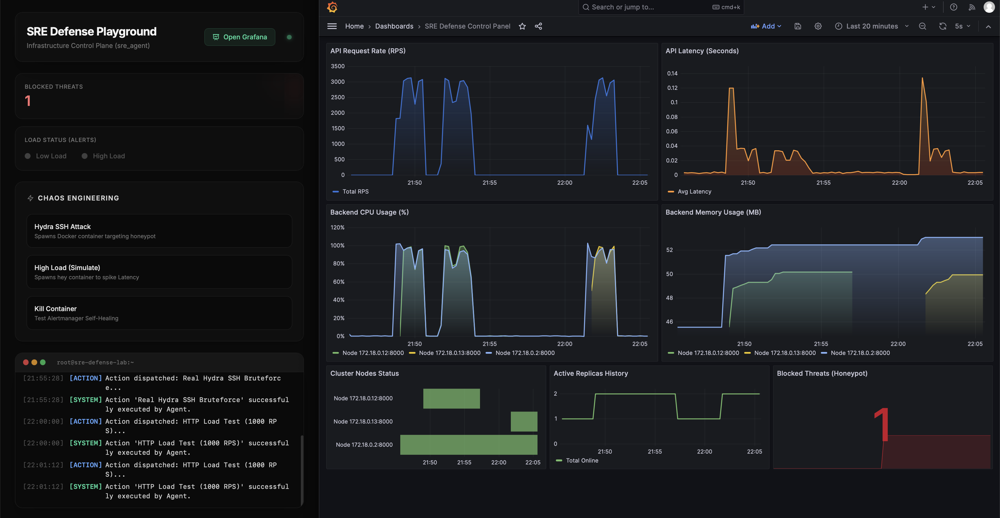

# Autonomous SRE Infrastructure



Этот проект представляет собой практическую реализацию принципов Site Reliability Engineering (SRE) и DevSecOps. Главная цель — показать, как можно построить отказоустойчивую микросервисную архитектуру, способную самостоятельно справляться с резкими скачками нагрузки, техническими сбоями и атаками злоумышленников без ручного вмешательства.

## Ключевые возможности

* **Автомасштабирование (Auto-Scaling):** Система непрерывно собирает RED-метрики. Если время ответа приложения (Latency) начинает деградировать под высокой нагрузкой, агент автоматически разворачивает дополнительные инстансы бэкенда и обновляет конфигурацию балансировщика без даунрайма (zero-downtime).
* **Активная киберзащита (Active Cyber Defense):** В инфраструктуру интегрирован SSH-ханипот. При обнаружении попыток брутфорса SRE-агент перехватывает IP-адрес атакующего и мгновенно добавляет его в черный список Nginx, блокируя доступ к основному API.
* **Самовосстановление (Self-Healing):** При критическом сбое или непредвиденной остановке целевого сервиса, инфраструктура фиксирует падение и автоматически перезапускает упавший узел, минимизируя время простоя.
* **Observability в реальном времени:** Все системные метрики (потребление ресурсов, RPS, Latency) и события безопасности собираются в Prometheus и визуализируются через Grafana, а также через кастомную панель управления.

## Архитектура и стек технологий

Проект использует микросервисную архитектуру с паттернами Blackbox и Whitebox мониторинга.

* **Backend & Control Plane:** Python 3, FastAPI
* **Оркестрация & Балансировка:** Docker Compose, Nginx
* **Мониторинг:** Prometheus, cAdvisor (для системных метрик), `prometheus_fastapi_instrumentator` (для сбора RED-метрик приложения)
* **Алертинг:** Alertmanager
* **Визуализация:** HTML/JS/TailwindCSS (кастомный дашборд), Grafana
* **Chaos Engineering:** Hydra (симуляция брутфорса), Hey (симуляция HTTP-нагрузки)

### Логика работы
1. Prometheus собирает метрики со всех контейнеров каждые 5 секунд.
2. При выходе метрик за допустимые пределы (например, Latency > 100ms) срабатывают правила в Alertmanager.
3. Alertmanager отправляет Webhook запросы в SRE Agent (управляющий слой системы).
4. SRE Agent парсит данные алерта и принимает соответствующее решение: масштабировать контейнеры (`docker-compose up --scale`), перезагрузить балансировщик (`nginx -s reload`) или заблокировать IP-адрес хакера.

## Быстрый старт

1. Склонируйте репозиторий и перейдите в папку проекта.
2. Запустите кластер с помощью Docker Compose:
   ```bash
   docker-compose up -d --build
   ```
3. После запуска будут доступны следующие интерфейсы:
   * **SRE Control Panel:** `http://localhost:80` (управление кластером и запуск тестов)
   * **Grafana:** `http://localhost:3000` (Логин: `admin` / Пароль: `admin`)
   * **Prometheus:** `http://localhost:9090`

## Chaos Engineering

Для тестирования системы в кастомный дашборд (Control Panel) встроена панель Chaos Engineering, позволяющая симулировать различные инциденты:

1. **Simulate Load (DDoS):** Генерирует HTTP-нагрузку. Позволяет наблюдать за деградацией Latency и последующим автомасштабированием сервиса.
2. **Bruteforce SSH:** Имитирует атаку на ханипот. Демонстрирует работу подсистемы безопасности, которая отслеживает атакующего и блокирует его IP на уровне Nginx.
3. **Kill Backend:** Принудительно останавливает контейнер бэкенда для проверки механизмов самовосстановления.